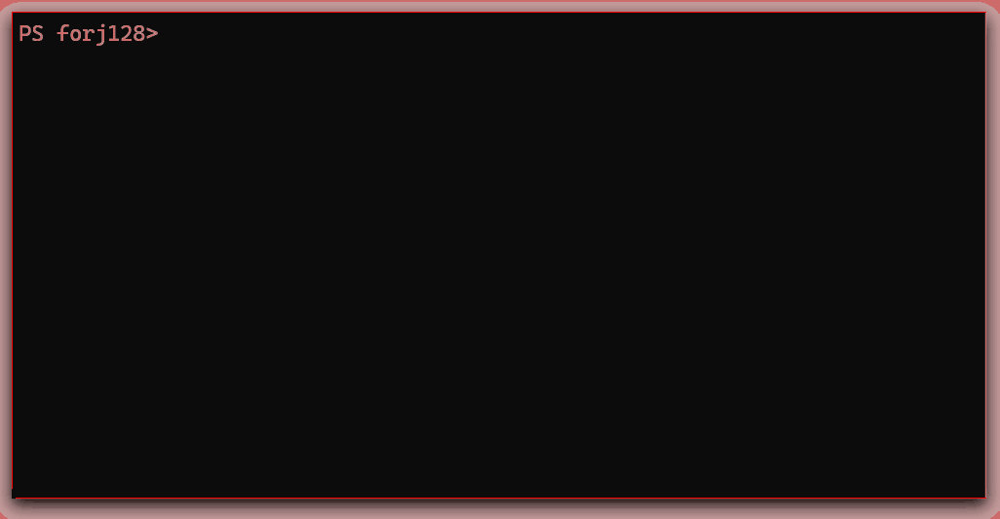

# forj128

[](https://opensource.org/licenses/MIT)
[](https://en.wikipedia.org/wiki/C_(programming_language))
[](https://www.gnu.org/software/make/)


Forj128 is an educational 128-bit hash function implemented from scratch in C. It is published on npm as `forj128` and on PyPI as `forj128`, and it is designed for experimentation, teaching, and non-security-critical fingerprinting rather than password protection or cryptographic signing.



> **Warning:** This project is for learning and experimentation. It is not cryptographically audited and should not be used to protect real secrets.

## What it does

Forj128 demonstrates a Merkle-Damgård style construction in a compact, readable implementation. It processes data in 512-bit blocks, derives runtime constants, uses a generated S-box, and produces a 16-byte digest that can be rendered as a 32-character lowercase hex string.

### Highlights

- Lightweight and dependency-free at the core C level
- Easy to inspect and adapt for teaching purposes
- Supports C, Python, and Node.js entry points
- Includes a small avalanche test to observe diffusion behavior

## Installation

### C library from source

Prerequisites:
- GCC or Clang
- Make
- The standard C math library (`libm`)

```bash
git clone https://github.com/Terminay/forj128.git
cd forj128
make
```

This produces:
- `forj128_cli` for hashing text from the command line
- `avalanche_test` for a simple diffusion benchmark
- `libforj128.so` for native integration

### Python

```bash
pip install forj128
```

Or from a local checkout:

```bash
cd python
pip install .
```

### Node.js

```bash
npm install forj128
```

For a local build from source:

```bash
cd node
npm install
npm run build
```

On Windows, native Node builds may require Visual Studio Build Tools with a compatible C/C++ toolchain such as ClangCL or MSVC.

## Usage

### Command line

```bash
./forj128_cli "hello world"
```

### C

```c
#include "forj128.h"

uint8_t digest[FORJ128_DIGEST_BYTES];
char hex[33];

forj128((const uint8_t *)"hello world", 11, digest);
forj128_to_hex(digest, hex);
printf("%s\n", hex);
```

### Python

```python
from forj128 import hash, hash_hex

print(hash(b"hello world").hex())
print(hash_hex(b"hello world"))
```

### Node.js

```javascript
const forj128 = require('forj128');

console.log(forj128.hashHex('hello world'));
```

## Use cases

Forj128 is best suited for:
- Learning how hash functions are structured
- Teaching Merkle-Damgård style design and avalanche behavior
- Building small fingerprints for non-security-critical caches or deduplication checks
- Experimenting with custom round functions and state layout

It is not a good fit for:
- Password storage
- Digital signatures
- Certificate or token validation
- Any security-sensitive verification flow

## Testing

Run the C regression tests:

```bash
make test
```

Run the avalanche benchmark:

```bash
./avalanche_test
```

Example output:

```text
Avalanche test over 2752 single-bit flips:
  Average bits flipped: 64.01 (50.0%)
  Ideal: 64.00 bits (50.0%)
```

## Design notes

| Aspect | Implementation | Notes |
|--------|---------------|-------|
| Construction | Merkle-Damgård style | Similar in spirit to classic hash designs |
| Digest size | 128 bits | 16 bytes |
| Block size | 512 bits | Standard block size for the design |
| IV | Runtime-derived fractional roots | Avoids hardcoded magic constants |
| Round constants | Runtime-derived from primes | Generated at startup |
| S-box | Seeded and shuffled | Introduces a custom permutation |
| Finalization | Cross-XOR and rotation | Adds a simple final mixing step |

## Limitations

- Not peer-reviewed or cryptographically audited
- No formal proof of collision resistance
- Not suitable for password hashing or secret protection
- Designed for education first, security second

## Contributing

Contributions are welcome, especially around test coverage, portability improvements, and documentation clarity.

## License

This project is licensed under the MIT License. See [LICENSE](LICENSE) for details.

## Credits

Built as a learning exercise to understand hash function design. It draws inspiration from classic constructions such as MD5 and SHA-family hashes, while remaining intentionally simple and inspectable.

**I would appreciate a ⭐ if you liked this project**
